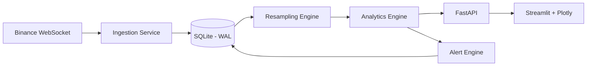

# Real-time Trader Helper Analytics (MVP)

A small but complete **end-to-end analytical application** that ingests real-time market data, performs quantitative analytics, and presents interactive visualizations for traders and quantitative researchers.

This project is designed as a **local prototype with production-grade architectural thinking**, suitable for extension to larger real-time analytics systems used in **statistical arbitrage, market-making, and risk-premia research**.

---

## 🎯 Problem Context

The application acts as a **helper analytics tool** for traders and researchers at a multi-factor trading firm operating across:

- Cash & derivatives markets  
- Statistical arbitrage  
- Micro-alpha research  
- Market-making  
- Term-structure and spread analysis  

The system demonstrates:
- Real-time data ingestion  
- Correct sampling and aggregation  
- Quantitative analytics  
- Interactive visualization  
- Clean, extensible system design  

---

## 🧠 Key Features

### 🔹 Real-time Data Ingestion
- Live tick data streamed from **Binance WebSocket**
- Tick schema: `{timestamp, symbol, price, quantity}`
- Asynchronous ingestion with reconnect and fault tolerance

### 🔹 Storage & Sampling
- Raw tick data stored in **SQLite (WAL mode)**
- On-the-fly resampling into:
  - **1s**, **1m**, **5m** OHLCV bars
- No artificial backfilling — analytics are computed **only when sufficient data exists**

### 🔹 Quantitative Analytics
For a selected symbol pair (A, B):
- OLS hedge ratio (log-price regression)
- Spread construction
- Rolling Z-score
- Rolling correlation
- Augmented Dickey-Fuller (ADF) test for stationarity
- Summary statistics updated in near real-time

### 🔹 Live Interactive Dashboard
- Built using **Streamlit + Plotly**
- Interactive controls for:
  - Symbol selection
  - Timeframe (1s / 1m / 5m)
  - Rolling window size
  - Lookback duration
- Charts support zoom, pan, and hover
- Live analytics refresh (~500ms latency)

### 🔹 Alerting
- User-defined rule-based alerts (e.g., `z-score > 2`)
- Alert events logged and displayed in the UI

### 🔹 Data Export
- Download resampled bars as CSV
- Download analytics time-series as CSV

---

## 🏗 Architecture Overview

The system is designed with **clear separation** between ingestion, storage, analytics, and visualization layers.  
The diagram below illustrates the **end-to-end data flow and component boundaries**.


## 🧩 Design Highlights

- **Loose coupling** between ingestion, analytics, storage, and UI
- Raw tick storage isolated from resampled and derived data
- Analytics engine independent of data source implementation
- Alert engine decoupled from visualization and API layers
- Clear extension points for:
  - New data feeds
  - New analytics
  - New visualization modules

---

## ⚙️ Tech Stack

| Layer | Technology |
|-----|-----------|
| Backend API | FastAPI |
| Streaming | WebSockets |
| Analytics | pandas, numpy, statsmodels |
| Storage | SQLite (WAL mode) |
| Visualization | Streamlit, Plotly |
| Language | Python 3.12 |

---

## 🚀 How to Run

### 1️⃣ Setup environment
```bash
python -m venv .venv
source .venv/bin/activate   # Windows: .venv\Scripts\activate
pip install -r requirements.txt
```
### 2️⃣ Start backend
```bash
python -m uvicorn src.api.main:app --reload
```
### 3️⃣ Start frontend (new terminal)
```bash
streamlit run src/ui/streamlit_app.py
```
Open browser at:
👉 http://localhost:8501

## 📊 Recommended Demo Configuration

```yaml
Symbol A: btcusdt
Symbol B: ethusdt
Timeframe: 1s
Rolling window: 20
Lookback: 600
Live refresh: 0.5s
```
## 📈 Why Some Charts Start Empty (By Design)

Rolling statistics such as **z-score** and **correlation** require a minimum number of bars to be statistically meaningful.

This system:

- ❌ Does **not** backfill or fabricate historical data  
- ✅ Computes analytics **only when sufficient samples exist**  

As a result, certain charts may initially appear empty until enough resampled bars are available.

This behavior mirrors **real production trading systems** and avoids unstable or misleading signals.

---

## 🔮 Extensibility & Scaling Considerations

Although this project runs locally, the architecture is intentionally designed to support future growth with minimal refactoring:

- Plug-and-play data sources (Binance → CME → REST APIs → historical CSVs)
- Advanced analytics modules (Kalman filters, robust regression, regime detection)
- Separation of ingestion, analytics, and alerting into independent services
- Introduction of message queues (Kafka / Redis Streams)
- Migration from SQLite to Redis, PostgreSQL, or TimescaleDB
- Horizontal scaling of analytics workers for multi-asset support

The current design prioritizes **clarity, modularity, and extensibility** over premature optimization, making it suitable as a foundation for a larger real-time analytics stack.


